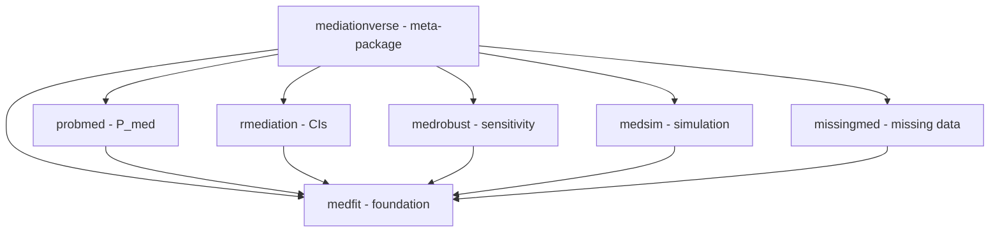

# MediationVerse Package Coordination

> **Coordinating releases and dependencies across 7 R packages**

---

## 📦 Package Overview

| Package | Last Push | Created | Status | Notes |
|---------|-----------|---------|--------|-------|
| [mediationverse](https://github.com/Data-Wise/mediationverse) | 2025-12-10 | 2025-12-04 | 🟢 Active | altdoc pilot complete |
| [medfit](https://github.com/Data-Wise/medfit) | 2025-12-04 | 2025-12-02 | 🟡 Maint | Navbar updates |
| [probmed](https://github.com/Data-Wise/probmed) | 2025-12-04 | 2025-12-01 | 🟡 Maint | pkgdown standardized |
| [rmediation](https://github.com/Data-Wise/rmediation) | 2025-12-05 | 2022-06-23 | ✅ CRAN | Badge updates |
| [medrobust](https://github.com/Data-Wise/medrobust) | 2025-12-04 | 2025-11-12 | 🟡 Maint | pkgdown added |
| [medsim](https://github.com/Data-Wise/medsim) | 2025-12-04 | 2025-12-04 | 🟡 Maint | Badge updates |
| [missingmed](https://github.com/Data-Wise/missingmed) | 2025-11-17 | 2025-11-16 | 🔵 Early | In development |
| [mbco](https://github.com/Data-Wise/mbco) | 2019-10-02 | 2019-09-07 | 📦 Archive | Research archive |

**Legend**: 🟢 Active | 🟡 Maintenance | ✅ CRAN | 🔵 Early Development | 📦 Archived

---

## 🔗 Dependency Graph

**Key Principle**: `medfit` changes require coordinated updates across all packages

---

## 🚀 Release Coordination

### Current Status (December 2025)

**Recent Activity**: Documentation standardization phase complete

- ✅ **mediationverse**: altdoc with Quarto successfully piloted (Dec 10)
- ✅ **All packages**: pkgdown sites standardized (Dec 4-5)
- ✅ **rmediation**: On CRAN, documentation updated (Dec 5)

**Next Release Window**: Q1 2025 (Jan-Mar 2025)

**Priorities**:

1. Resume active development on core packages
2. Prepare medfit for CRAN submission
3. Update dependent packages after medfit release

### Target Packages for Q1 2025

- [ ] **medfit** - Foundation package (blocks others)
- [ ] **rmediation** - Update if medfit changes require it
- [ ] **probmed** - Coordinate with medfit release

### Release Checklist (Per Package)

- [ ] All tests passing (`R CMD check --as-cran`)
- [ ] NEWS.md updated with changes
- [ ] Version bumped in DESCRIPTION
- [ ] README examples verified
- [ ] Vignettes render correctly
- [ ] Dependencies up-to-date
- [ ] CRAN comments addressed
- [ ] Tag created in GitHub
- [ ] Submit to CRAN

---

## ⚠️ Breaking Changes Protocol

### Before Making Breaking Changes

1. **Document** in `BREAKING_CHANGES.md`
2. **Notify** downstream package maintainers
3. **Coordinate** release timing
4. **Deprecate** gracefully (1-2 versions warning)
5. **Update** all examples and vignettes

### Current Breaking Changes in Pipeline

| Package | Change | Affects | Target Version | Status |
|---------|--------|---------|----------------|--------|
| | | | | |

---

## 🔄 S7 Migration Strategy

### Migration Order

1. **Phase 1**: `medfit` (foundation)
2. **Phase 2**: `probmed`, `rmediation` (depend on medfit)
3. **Phase 3**: `medrobust`, `medsim`, `missingmed`
4. **Phase 4**: `mediationverse` (meta-package update)

### S7 Migration Progress

**Phase 0**: Documentation Standardization

- [x] `mediationverse` - altdoc with Quarto (✅ Complete 2025-12-10)
- [x] `medfit`, `probmed`, `rmediation`, `medrobust`, `medsim` - pkgdown standardized (✅ Complete 2025-12-04)

**Phase 1**: Active Development (Planned)

- [ ] `medfit` - Resume S7 migration
- [ ] `probmed` - Awaiting medfit
- [ ] `rmediation` - Awaiting medfit
- [ ] `medrobust` - Awaiting medfit
- [ ] `medsim` - Awaiting medfit
- [ ] `missingmed` - Early development continues

---

## 📊 Quality Metrics

### Test Coverage

| Package | Coverage | Target |
|---------|----------|--------|
| medfit | | 80% |
| probmed | | 80% |
| rmediation | | 80% |
| medrobust | | 80% |
| medsim | | 80% |
| missingmed | | 80% |

### CRAN Check Status

Last checked: [Date]

- ✅ All packages passing
- ⚠️ Warnings: [List]
- ❌ Errors: [List]

---

## 🎯 Quarterly Goals

### Q1 2025 (Updated 2025-12-11)

- [x] Pilot altdoc on mediationverse (✅ DONE 2025-12-10)
- [x] Standardize pkgdown sites across all packages (✅ DONE 2025-12-04)
- [ ] Resume medfit S7 migration and active development
- [ ] Run R CMD check --as-cran on all packages
- [ ] Complete medfit CRAN submission
- [ ] Prepare probmed and rmediation for Q2 submissions

### Q2 2025 (Planned)

- [ ] Submit probmed to CRAN
- [ ] Submit updated rmediation to CRAN
- [ ] Rollout altdoc to additional packages
- [ ] Coordinate medrobust and medsim updates

---

## 📝 Meeting Notes

### [Date] - Sync Meeting

- **Attendees**:
- **Agenda**:
- **Decisions**:
- **Action Items**:
